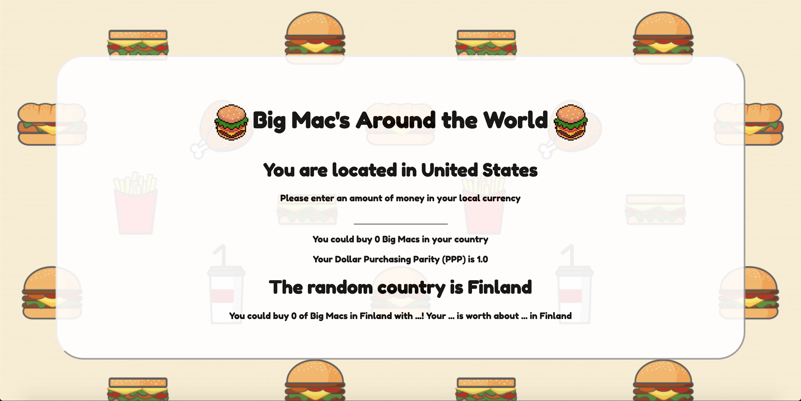
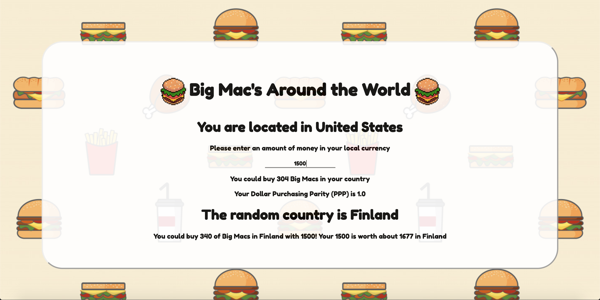

# Big Mac's Around the World




## Introduction

**Deployed Link**: https://bigmac.vercel.app/

This is a Next.js app that allows user's to compare their local country's Big Mac price to another random country. First, the site grabs the user's IP address to locate their country. It will generate a random country as well and once an input of money is entered, the site will tell the user how many Big Mac's they can buy, and compare how many Big Mac's they can buy in the random country as well.

## Instructions

- Clone the git repo to your local machine.

- Run the development server:

```bash
npm run dev
# or
yarn dev
```

- Open [http://localhost:3000](http://localhost:3000) with your browser to see the result.

## Technologies Used

- HTML, CSS, JavaScript
- Next.js
- React
- Node.js
- node-fetch
- Lodash
- node-cache
- csv-parser
